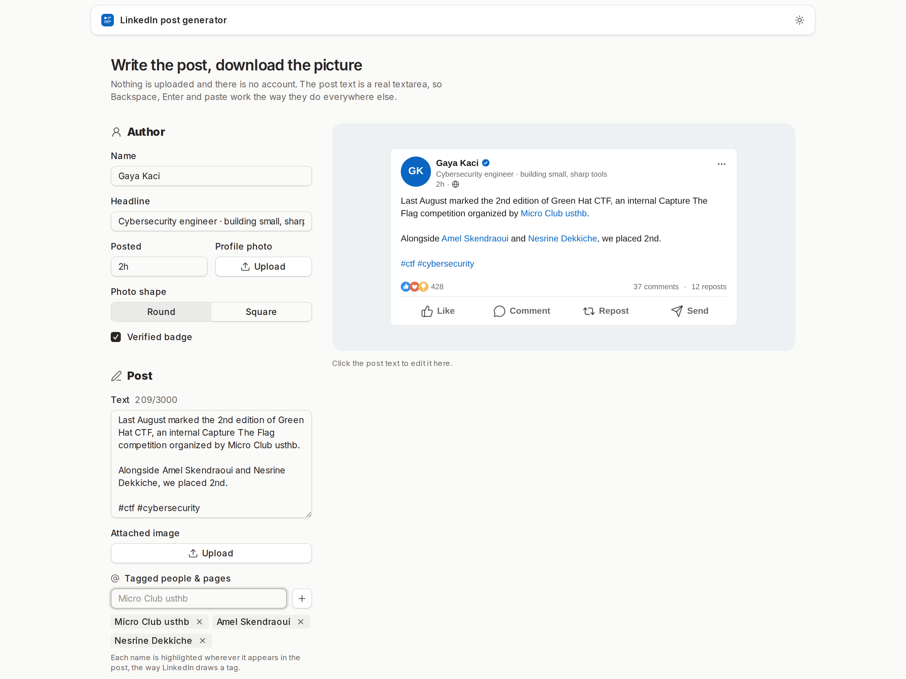
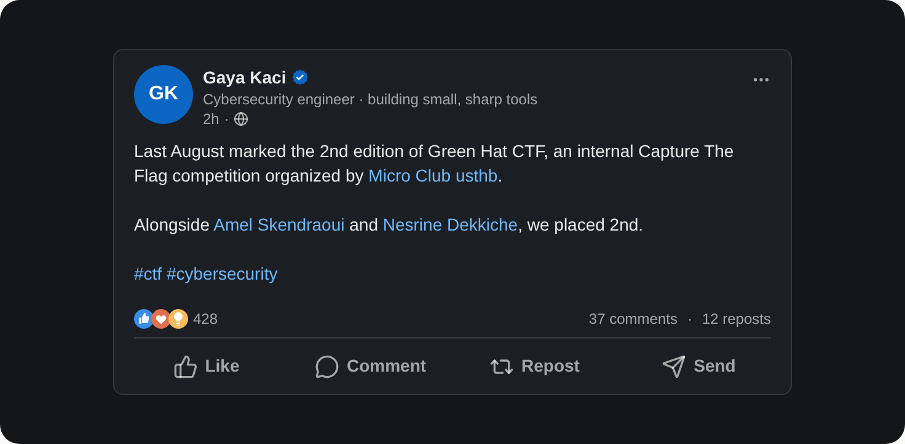
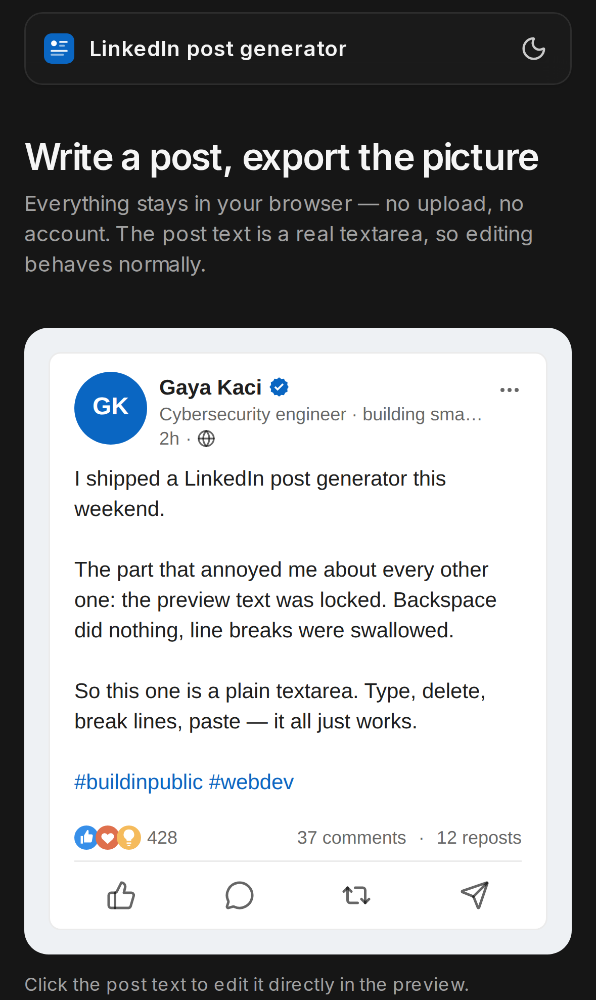

<p align="center">
  
</p>

<h1 align="center">LinkedIn post generator</h1>

<p align="center">
   <strong>A LinkedIn post mockup you can actually edit, exported as a PNG.</strong><br>
   <em>Type the post, tweak the details, download the picture. Nothing leaves the browser.</em>
</p>

The post text is a plain `<textarea>`, not a `contenteditable` div. Backspace, Delete, Enter,
paste, undo, and IME input all behave the way the browser intended, which is the one thing most
generators of this kind get wrong. There are no accounts, no uploads, and no backend.

Live at [kacigaya.github.io/linkedin-post](https://kacigaya.github.io/linkedin-post/).

## Screenshots

### Editor and live preview



### Exported card



### On a phone



## Features

- Edit the post body inline in the preview, or in the form beside it, with a highlight layer that colours hashtags and tags while you type
- Tag people and pages: add a name and every occurrence of it renders in LinkedIn's link blue, bold in the export
- Set name, headline, timestamp, and verified badge
- Upload a profile photo, round for a member or square for a company page, with an initials fallback when there is none
- Attach an image to the post
- Fake the reaction, comment, and repost counts, formatted the way LinkedIn compacts them past 999
- Truncate the body with "…see more", clamped identically in the editor and the export
- Switch the card between LinkedIn's light and dark themes, independently of the app theme
- Frame the card on a backdrop, then download the PNG or copy it straight to the clipboard
- Light and dark app themes that follow the system by default

## Tech stack

- Framework: Next.js 16 (App Router)
- UI: React 19, Tailwind CSS 4, [coss ui](https://coss.com/ui) components on Base UI, Lucide icons
- Language: TypeScript
- Export: [html-to-image](https://github.com/bubkoo/html-to-image)
- Toolchain: Bun 1.3, Node 24
- Testing: `bun test`

Demo posts and grey field examples are selected locally on each page load. Reset restores
that page’s demo; examples stay fixed while editing. No post content is stored.

## Configuration

There is none. Every feature runs client-side, so the app reads no environment variables and
holds no state between visits. Uploaded photos are read as data URLs and stay in the page.

## Running from source

### Prerequisites

- Bun 1.3+
- Node.js 24+

### Installation

```bash
bun install
```

### Development

```bash
bun run dev
```

Open [http://localhost:3000/linkedin-post/](http://localhost:3000/linkedin-post/) to view the
app. The `/linkedin-post` prefix is the GitHub Pages `basePath`; the bare root 404s.

### Validation

```bash
bun run check      # typecheck, unit tests, static export
bun run typecheck
bun test app
bun run build      # writes the site to out/
```

### Project structure

```
app/            # Next.js App Router entry, layout, global styles, icon
  components/   # PostCard, the exported card, and its LinkedIn-only SVGs
  lib/          # Count formatting, tag matching, file reading, and their tests
components/     # SiteNav, theme provider, and the coss ui primitives
public/         # Icon and README screenshots
.github/        # Pages deploy workflow
```

## How the export works

The preview and the PNG are the same DOM. `html-to-image` serialises the framed card, at a
`pixelRatio` scaled from the rendered width so a phone export is still roughly desktop-sized.

Two details make that work. A cloned `<textarea>` serialises without its value, so the card
swaps the editor for static markup for the duration of the capture — that is what
`mode="static"` in `PostCard` is for. And a freshly picked image may still be decoding, so
every `` is awaited before the capture starts.

## Tagging people and pages

LinkedIn stores a mention as a link rather than as syntax, so a tagged name is just ordinary
words in the post body. Add the names you tagged and each one is highlighted wherever it
appears, longest name first, so tagging both "Micro Club" and "Micro Club usthb" highlights the
full page name.

The highlight layer under the editor renders tags at regular weight even though the export
bolds them. Bold glyphs are wider, and a bold overlay wraps differently from the plain textarea
above it, which drags the caret away from the text it should sit next to.

## Deployment

Static export (`output: "export"`) published to GitHub Pages by
[`.github/workflows/pages.yml`](.github/workflows/pages.yml) on every push to `main`. The
workflow runs `bun run check`, uploads `out/`, and deploys it; nothing runs at request time.
Pages cannot set response headers, so the Content Security Policy ships as a `<meta>` tag.

To serve `out/` elsewhere, keep the `/linkedin-post` path prefix or change `basePath` and
`SITE_URL` first.

## Notes

The card mimics LinkedIn's layout for mockups and screenshots. It is not affiliated with
LinkedIn, and the exported image is not a real post.

## License

AGPL-3.0-or-later. See [LICENSE](LICENSE).
